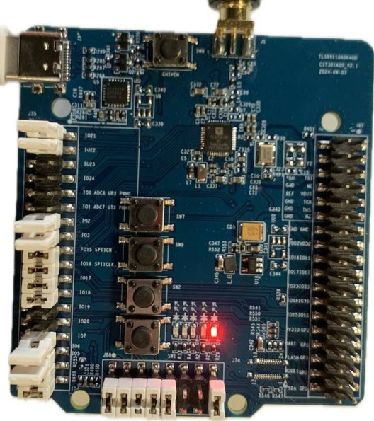
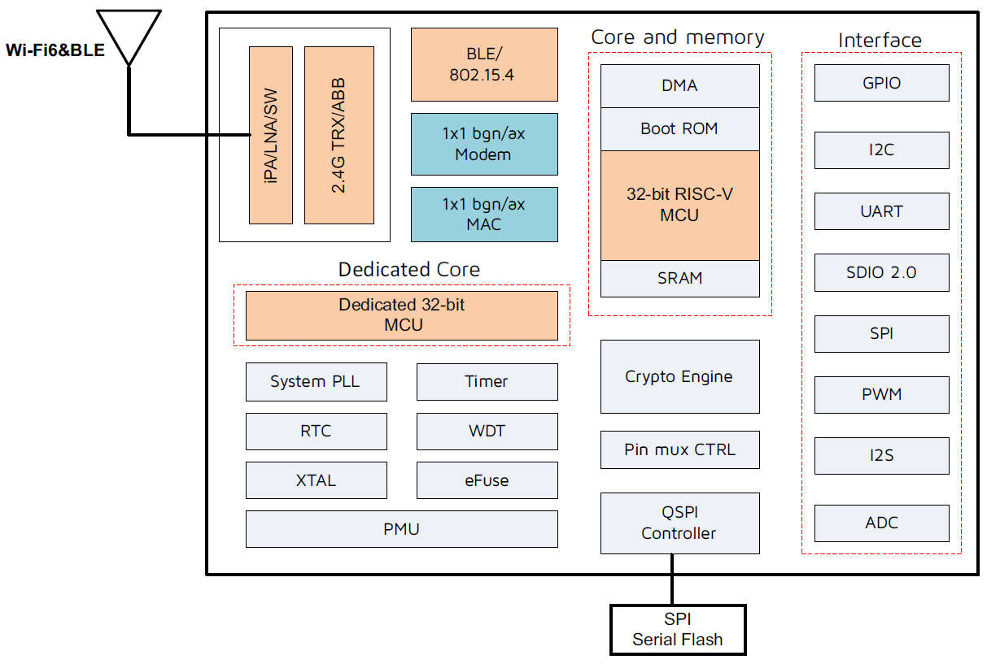

.. _tlsr9118bdk40d:

Telink TLSR9118BDK40D
#####################

Overview
********

The TLSR9118BDK40D Generic Starter Kit is a hardware platform which
can be used to verify the `Telink TLSR9 series chipset`_ and develop applications
for several 2.4 GHz air interface standards including Bluetooth 5.2 (Basic data
rate, Enhanced data rate, LE, Indoor positioning and BLE Mesh),
Zigbee 3.0, Homekit, 6LoWPAN, Thread and 2.4 Ghz proprietary.

More information about the board can be found at the `Telink W91 Generic Starter Kit Hardware Guide`_ website.

Hardware
********

The TLSR9118BDK40D SoC integrates a powerful 32-bit RISC-V single-core MCU, a dedicated 32-bit MCU for
Wi-Fi and Bluetooth, 2.4 GHz radio, 576 KB SRAM, 384 KB ROM, 4 MB Flash, 12-bit SAR ADC, PWM, flexible
IO interfaces, and other peripheral blocks required for Wi-Fi, Bluetooth LE and Zigbee/Thread application
development. The TLSR9118 also includes multi-stage power management design allowing ultra-low power
operation and making it the ideal candidate for power-constraint applications.

The TLSR9118BDK40D default board configuration provides the following hardware components:

- RF conducted antenna
- Micro-SD card reader slot
- Chip reset button
- Two USB type-C to UART interfaces
- 4-wire JTAG
- Key matrix up to 4 keys
- 2 LEDs

Supported Features
==================

The Zephyr TLSR9118BDK40D board configuration supports the following hardware features:

+----------------+------------+------------------------------+
| Interface      | Controller | Driver/Component             |
+================+============+==============================+
| PLIC           | on-chip    | interrupt_controller         |
+----------------+------------+------------------------------+
| RISC-V Machine | on-chip    | timer                        |
| Timer (32 KHz) |            |                              |
+----------------+------------+------------------------------+
| PINCTRL        | on-chip    | pinctrl                      |
+----------------+------------+------------------------------+
| GPIO           | on-chip    | gpio                         |
+----------------+------------+------------------------------+
| UART           | on-chip    | serial                       |
+----------------+------------+------------------------------+
| PWM            | on-chip    | pwm                          |
+----------------+------------+------------------------------+
| TRNG           | on-chip    | entropy                      |
+----------------+------------+------------------------------+
| FLASH (MSPI)   | on-chip    | flash                        |
+----------------+------------+------------------------------+
| RADIO          | on-chip    | Bluetooth, WiFi,             |
|                |            | ieee802154, OpenThread       |
+----------------+------------+------------------------------+
| SPI (Master)   | on-chip    | spi                          |
+----------------+------------+------------------------------+
| I2C (Master)   | on-chip    | i2c                          |
+----------------+------------+------------------------------+
| ADC            | on-chip    | adc                          |
+----------------+------------+------------------------------+
| AES            | on-chip    | mbedtls                      |
+----------------+------------+------------------------------+
| PKE            | on-chip    | mbedtls                      |
+----------------+------------+------------------------------+

Board supports HW cryptography acceleration (AES and ECC till 256 bits). MbedTLS interface is used as cryptography front-end.

Default configuration and IOs
=============================

System Clock
------------

The TLSR9118BDK40D board is configured to use the 40 MHz external crystal oscillator
with the on-chip PLL/DIV generating the 160 MHz system clock.
The following values also could be assigned to the system clock in the board DTS file
(``boards/riscv/tlsr9118bdk40d/tlsr9118bdk40d-common.dtsi``):

- 16000000
- 24000000
- 32000000
- 48000000
- 60000000
- 96000000

.. code-block::

   &cpu0 {
       clock-frequency = <160000000>;
   };

PINs Configuration
------------------

Serial Port
-----------

The TLSR9118BDK40D SoC has 2 UARTs. The Zephyr console output is assigned to UART1 (J47 connector).
The default settings are 115200 8N1.

Programming and debugging
*************************

Building
========

.. important::

   These instructions assume you've set up a development environment as
   described in the `Zephyr Getting Started Guide`_.

To build applications using the default RISC-V toolchain from Zephyr SDK, just run the west build command.
Here is an example for the "blinky" application.

.. code-block:: console

   # From the root of the zephyr repository
   west build -b tlsr9118bdk40d samples/basic/blinky

Open a serial terminal with the following settings:

- Speed: 115200
- Data: 8 bits
- Parity: None
- Stop bits: 1

Flash the board, reset and observe the following messages on the selected
serial port:

.. code-block:: console

   D25 core ->  [0] vendor 0000031e, arch 80000025

Flashing
========

To flash the TLSR9118BDK40D board ensure that SW25 switch is in the next state:

+----------+-----+-----+---+---+
| Switch # | 1   | 2   | 3 | 4 |
+==========+=====+=====+===+===+
| Position | "+" | "-" | 0 | 0 |
+----------+-----+-----+---+---+

Then use the west flash command. Download Senscomm tool `Burning and Debugging Tools`_
and extract archive into some directory you wish TELINK_SCTOOL_BASE_DIR. This archive includes both versions for Linux
and Windows.

- Now you should be able to run the west flash command with the sctool path specified (TELINK_SCTOOL_BASE_DIR).

.. code-block:: console

   west flash --sctool-path TELINK_SCTOOL_BASE_DIR --usb-port /dev/ttyUSB0

- You can also run the west flash command without sctool path specification if TELINK_SCTOOL_BASE_DIR is in your environment (.bashrc).

.. code-block:: console

   export TELINK_SCTOOL_BASE_DIR="/opt/telink_sctool/"

After flashing move SW25 to this state:

+----------+-----+-----+---+---+
| Switch # | 1   | 2   | 3 | 4 |
+==========+=====+=====+===+===+
| Position | "+" | "+" | 0 | 0 |
+----------+-----+-----+---+---+

Reset the board.

References
**********

.. target-notes::

.. _Telink TLSR9 series chipset: [UNDER_DEVELOPMENT]
.. _Telink W91 Generic Starter Kit Hardware Guide: [UNDER_DEVELOPMENT]
.. _Burning and Debugging Tools : http://101.34.157.135/tools_and_sdk/Tools/SCM_Flash_Tool_v2.0.2.zip
.. _Zephyr Getting Started Guide: https://docs.zephyrproject.org/latest/getting_started/index.html
